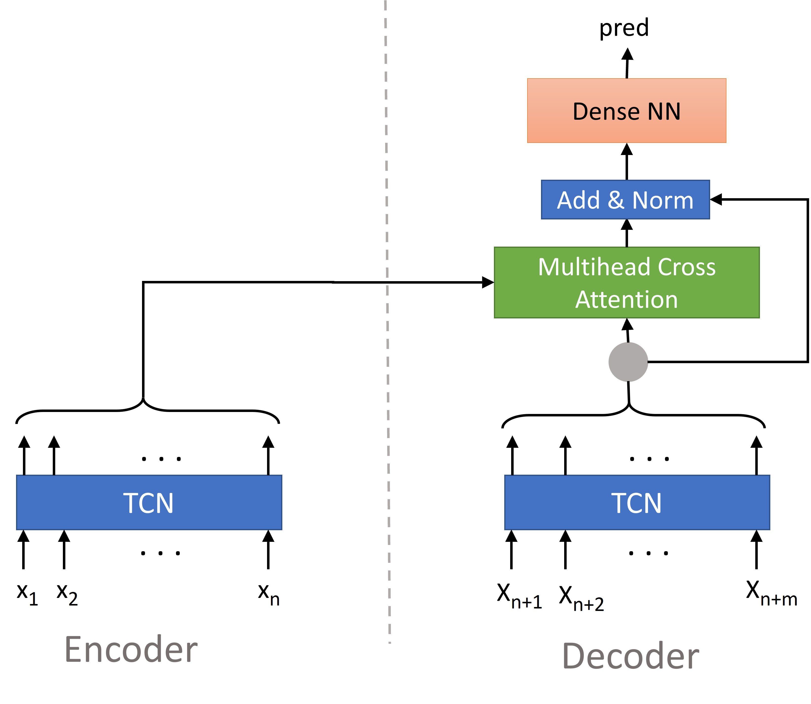
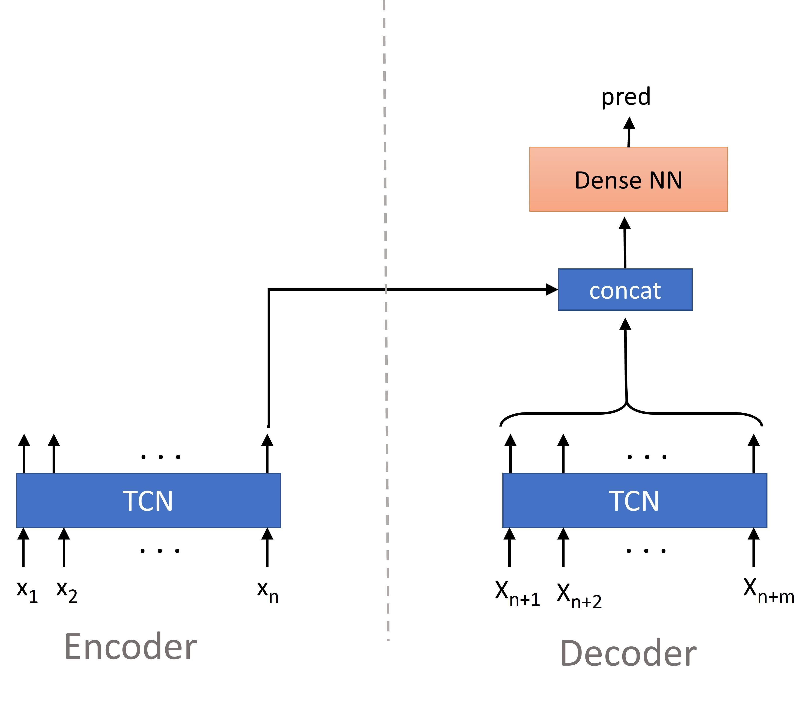
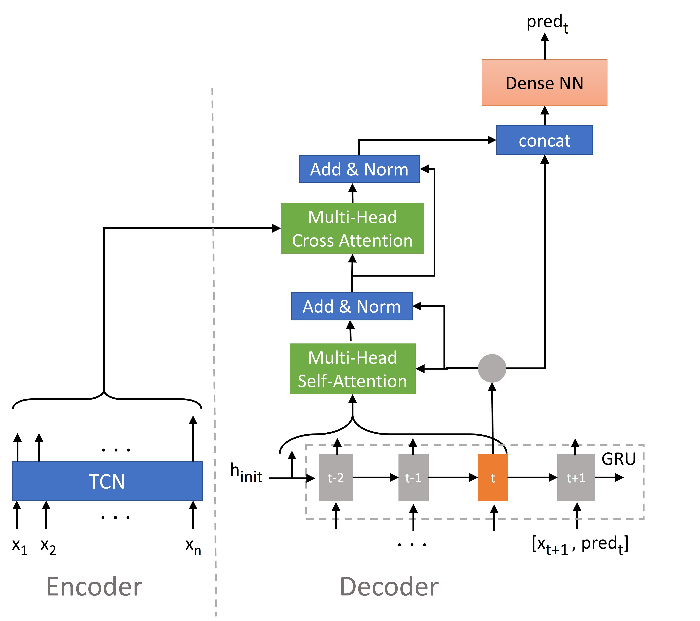
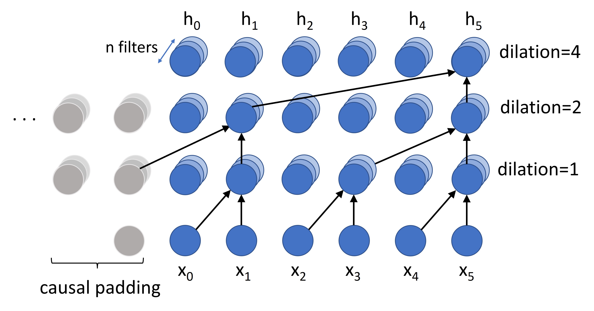
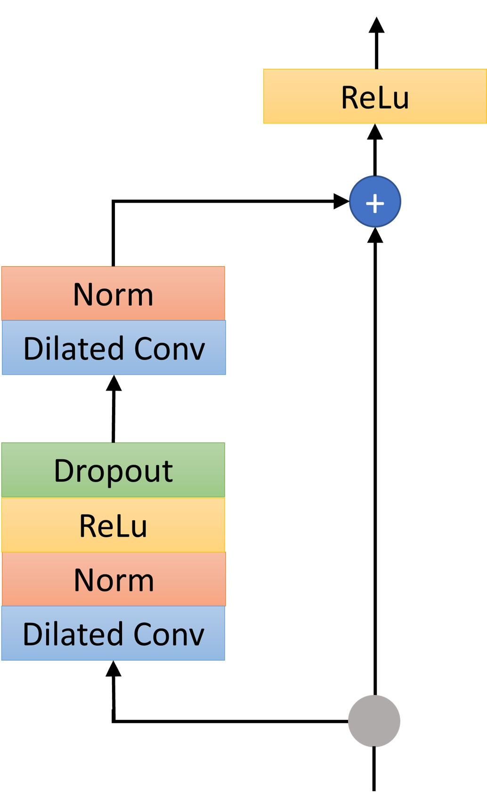

# TCN_Seq2Seq
Implementation of different TCN based Sequence-to-Sequence models for timeseries 
forecasting. 

The project includes wrapper classes for the models that add some additional 
features like simple saving and loading of the trained models and automated 
hyperparameter tuning. Also, there is functionality for basic data preprocessing 
as well as saving and loading the preprocessing configurations.  
The project is written in Python 3.8 using Tensorflow 2.5.0

TCN_Seq2Seq is on PyPI, so you can use `pip` to install it.

```bash
pip install --upgrade pip
pip install tcn-sequence-models
```

### Models
Three models exist:
#### 1. TCN-TCN model with attention. 

The structure of the TCN-TCN model with attention can be seen below.




#### 2. "Normal" TCN-TCN model without attention. 

The structure of the "normal" TCN-TCN model without attention can be seen below.




There are two versions of the TCN-TCN models, an autoregressive model and a 
none-autoregressive model.

Autoregressive model:
For training, teacher-forcing is used for the decoder. In addition to other decoder 
input data that is defined by the user, always the ground truth of the previous time 
step is added as an additional feature. For example at position x(n+1) the ground 
truth at position x(n) is added as an additional input.
During inference, the predictions of the previous time step is used instead.
The autoregressive model can be trained fast in a parallel way. However, inference 
is slow because the decoder needs to be passed m times when the output length is m.

None-regressive model:
For the none-regressive model only the input features are used for the decoder that 
the user provides. If the user does not provide any features for the decoder, a 
dummy feature is created with all 1s so that the decoder has some input. Without any 
input the model would not work. This model is fast during training and inference.


#### 3. TCN-RNN model.
The architecture of the TCN-RNN model can be seen in the following image:



### TCN blocks
The TCN blocks use as many layers as needed to get a connection from first timestep's 
input to last timestep's output. The padding mode in the models can be set by the user.
Only if set to 'causal', the blocks are "temporal", i.e. a timestep only gets 
information from the previous timesteps. If set to 'same' or 'valid', also information from 
future timesteps are used which might improve the predictions. 

The encoder of the "normal" TCN-TCN model will always have "causal" padding since 
only the last output of the encoder is used.
Also, for the decoder of the TCN-TCN models in the autoregressive mode, padding will 
always be causal. The picture below shows the TCN block with 'causal' padding.


One TCN cell (residual block) is structured like this (when choosing ReLu as 
activation function):




### Inputs
The models expect input sequences for the encoder and optionally for the decoder.

### Examples
For examples, please refer to the notebooks.

