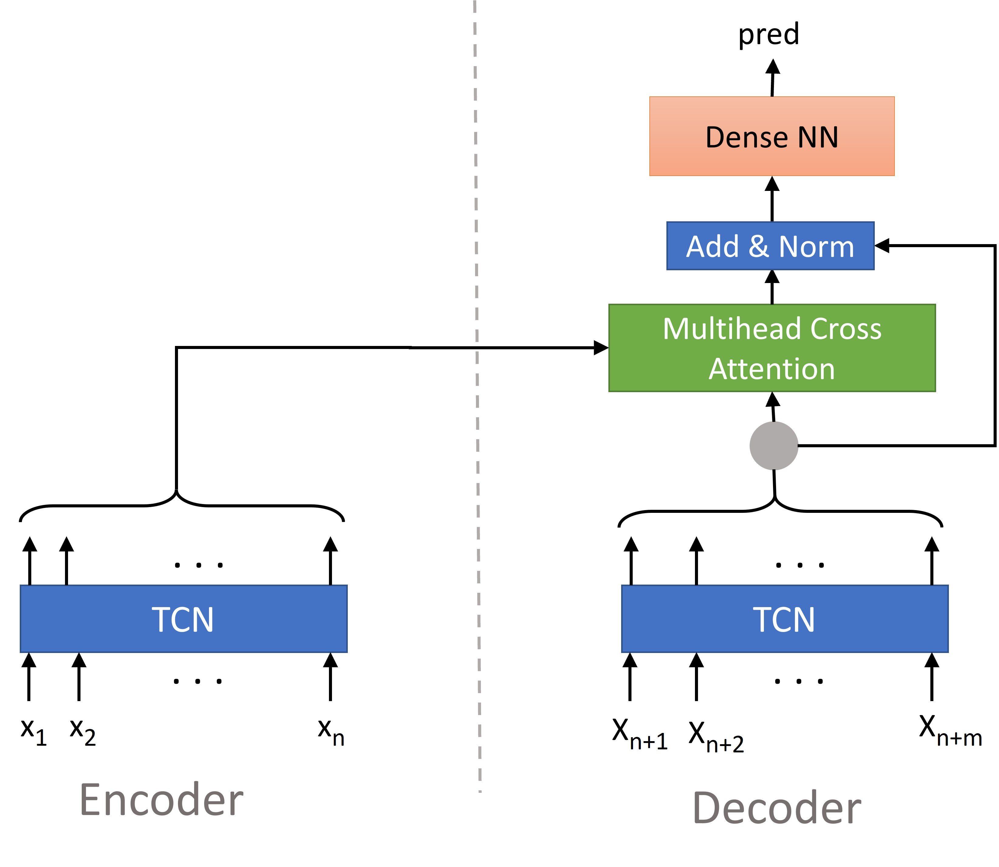

# TCN_Seq2Seq

The entire project is written in Python 3.8 using Tensorflow 2.5.0

### TCN-Seq2Seq Model
TCN-based sequence-to-sequence model for time series forecasting.

### Encoder
The encoder consists of a TCN block.

### Decoder
The Decoder architecture is as follows:  
First a TCN stage is used to encoder the decoder input data.
After that multi-head cross attention is applied the the TCN output and the
encoder output.
Then another TCN stage is applied. The input of this TCN stage is a
concatenation of the output of the first Decoder-TCN and the output of the
cross attention.
The last stage is the prediction stage (a block of dense layers) that then
makes the final prediction.

### TCN blocks
The TCN blocks use as many layers as needed to get a connection from first timestep's 
input to last timestep's output. Padding can be set by the user. (usually 'causal')

### Inputs
This model expects input sequences both for the encoder and for the decoder.  
The timesteps of the decoder inputs correspond to the timesteps of the made predicitons.
Inputs: [encoder_input, decoder_input]

Note: With the commit from 8/27/2021 the architecture was changed
